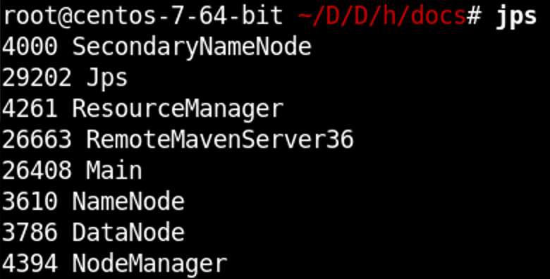
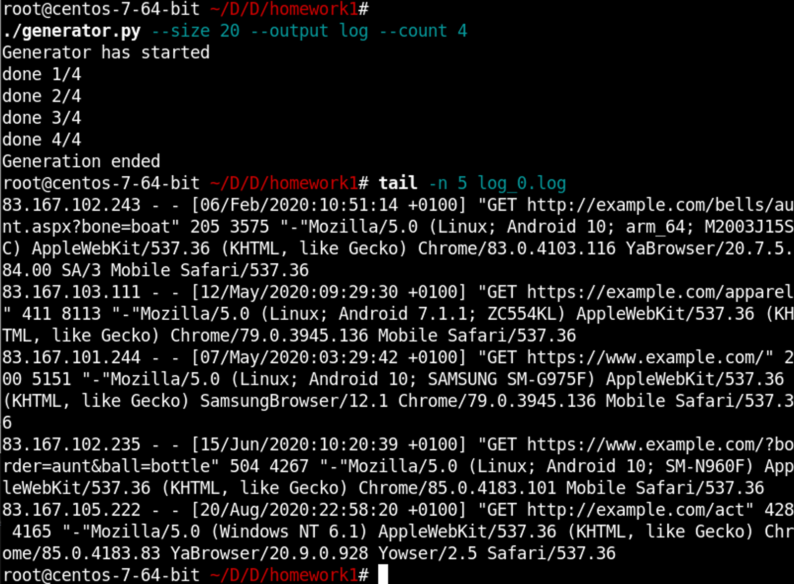
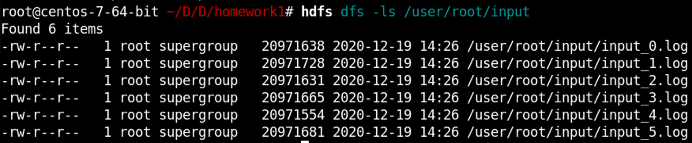
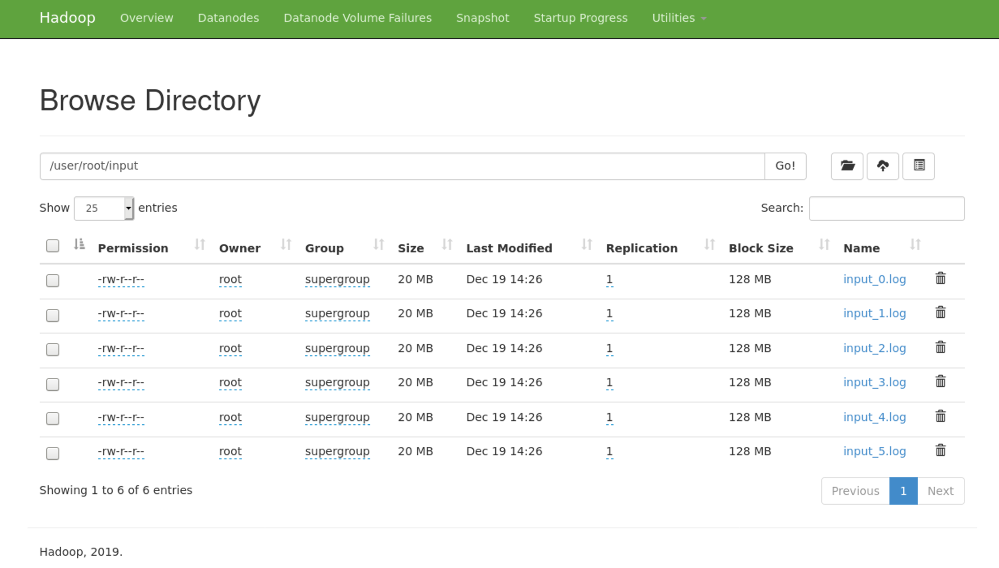
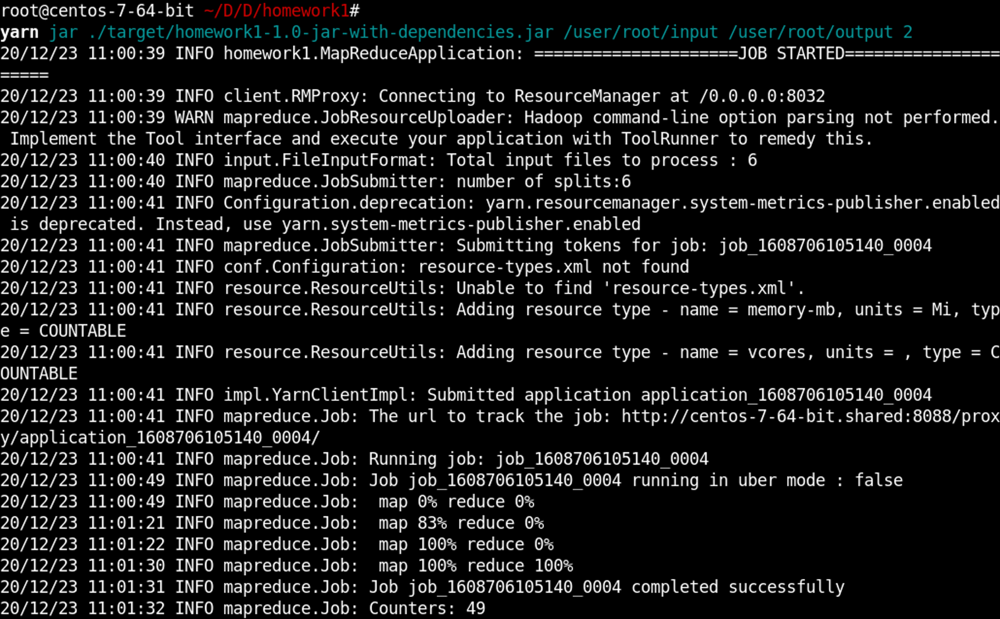
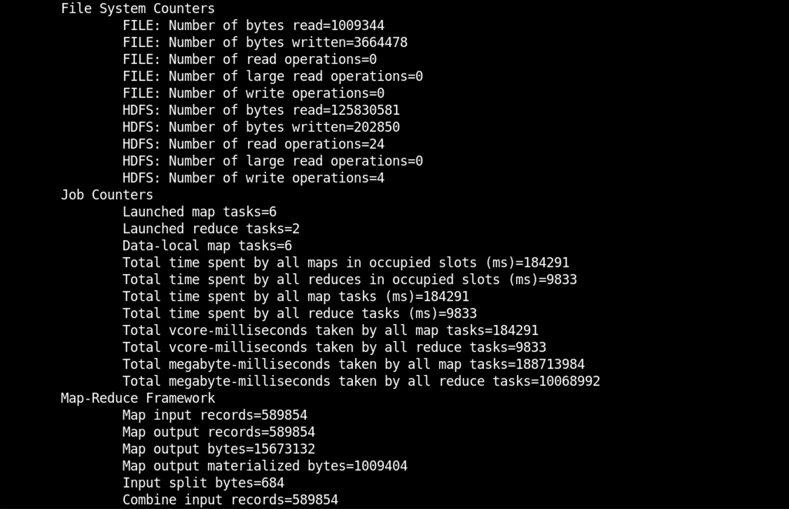
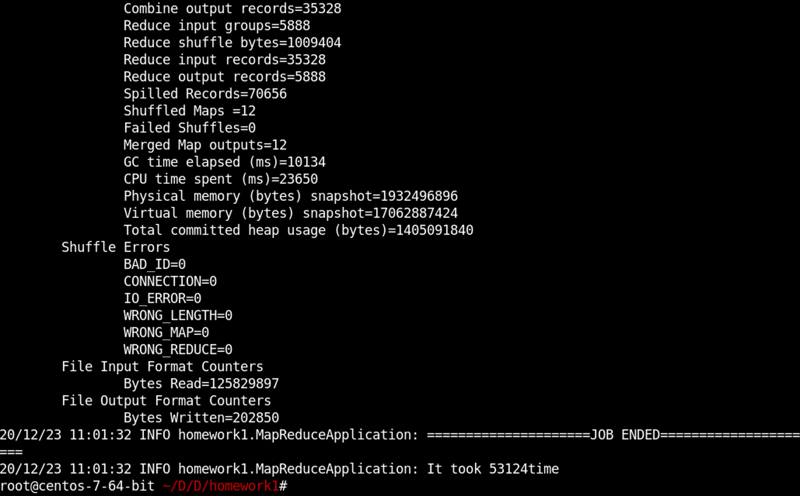
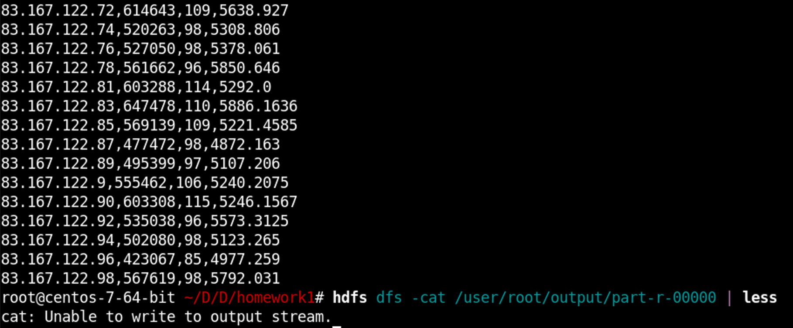
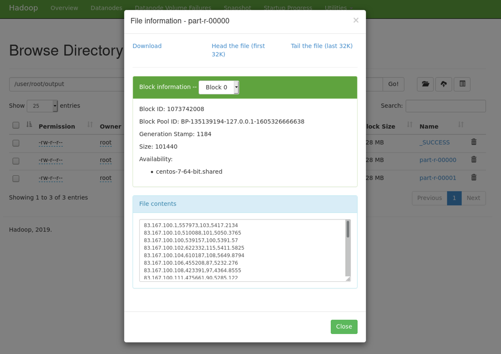
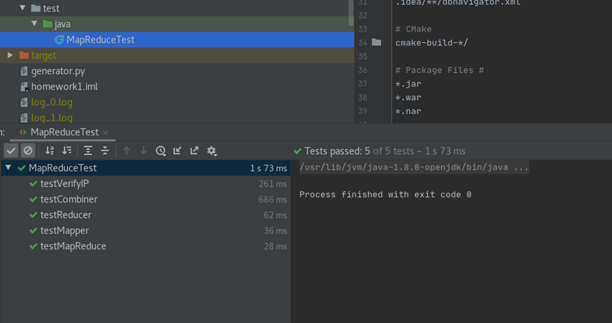

# Progress report

#### Result of running hdfs and yarn

#### Result of successful generation of input data

#### Result of loading output into hdfs

#### The result of starting and executing the program

##### result

#### Test run result

